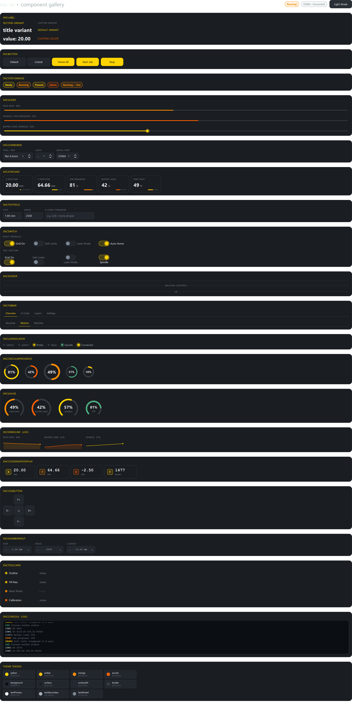
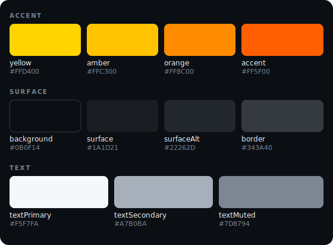
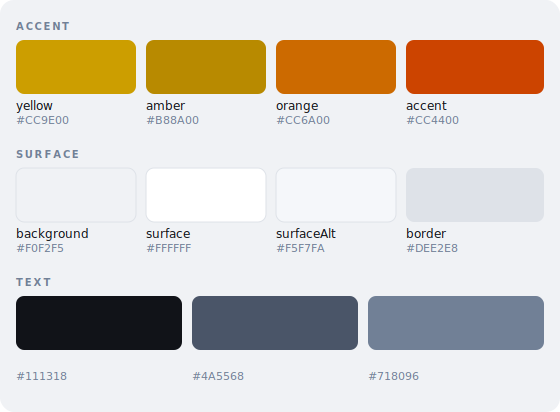

# snc-ui

A QML component library for Qt 6 with a dark industrial theme, built for 2D plotter and CNC control interfaces.

## Preview



## Palette




## Components

| Component | Description |
|---|---|
| `SncButton` | Push button with default and accent variants |
| `SncPanel` | Dark surface container |
| `SncLabel` | Text with semantic variants: `title`, `section`, `caption`, `value` |
| `SncSlider` | Track slider with glow handle |
| `SncSwitch` | Toggle switch with configurable label position |
| `SncTextField` | Text input with yellow focus ring |
| `SncComboBox` | Dropdown with dark popup and yellow selection highlight |
| `SncStatusBadge` | Pill badge for status indicators |
| `SncStatCard` | Metric card with label, value, unit and mini progress bar |
| `SncCircularProgress` | Canvas-drawn arc progress ring |
| `SncGauge` | 270° arc gauge with label |
| `SncSparkline` | Live line chart with rolling buffer |
| `SncLedIndicator` | Glowing dot indicator with configurable label position |
| `SncConsole` | Scrollable log output with color-coded message types |
| `SncCoordinateDisplay` | DRO-style axis readout |
| `SncJogButton` | Hold-to-repeat jog button |
| `SncNumberInput` | Increment/decrement number input |
| `SncTabBar` | Tab bar with animated underline |
| `SncDivider` | Horizontal/vertical divider with optional center label |
| `SncToolCard` | Layer row with color dot and visibility toggle |

## Theme

All components use `Theme { id: theme }` for colors. Switch between built-in palettes at runtime:

```qml
import Snc.Ui

// dark (default) or light
ThemeMode.current = "light"
ThemeMode.current = "dark"
```

Adding a new palette is as simple as extending the conditionals in `Theme.qml`.

## Requirements

- Qt 6.5 or later
- CMake 3.16 or later

## Build

```bash
cmake -B build
cmake --build build
```

Run the gallery:

```bash
./build/snc_ui_gallery
```

## Install

```bash
cmake --build build
cmake --install build --prefix /path/to/install
```

This installs:
- `lib/` — compiled QML module (`.dll` / `.so`)
- `lib/cmake/SncUi/` — CMake package config files
- `share/SncUi/qml/Snc/Ui/` — QML source files

## Using in Another Project

**CMakeLists.txt:**
```cmake
find_package(SncUi REQUIRED)

target_link_libraries(my_app PRIVATE SncUi::snc_ui_qml)
```

**Configure:**
```bash
cmake -B build -DCMAKE_PREFIX_PATH=/path/to/install
```

**QML:**
```qml
import Snc.Ui

SncButton { text: "Connect" }
SncGauge   { value: 0.72; label: "FEED"; gaugeColor: theme.yellow }
```
